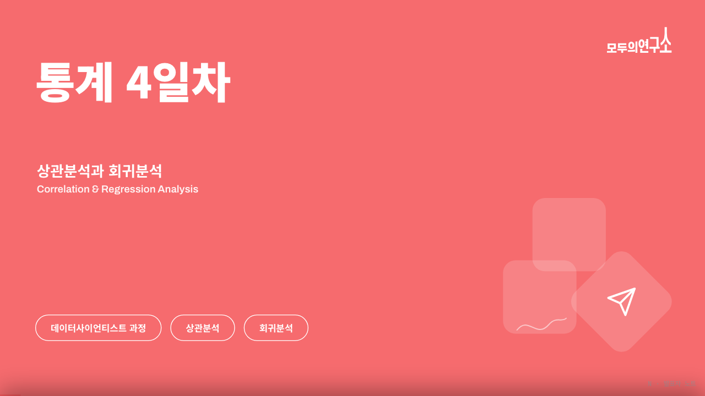
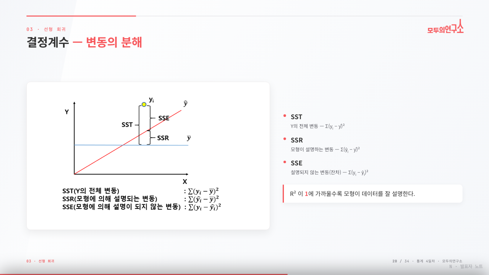

# modulabs-slides 🎨

> **모두의연구소(Modulabs) 브랜드 스타일의 16:9 HTML 슬라이드 덱**을 만들어주는 [Claude Code](https://claude.com/claude-code) 스킬입니다.
> 노트·주제·영상 자막·기존 PPTX를 → 의존성 없는 단일 HTML 프레젠테이션으로 변환합니다.

<p>
  
  
</p>

<sub>↑ 이 스킬로 생성한 실제 결과물 (통계 강의자료를 변환한 예시)</sub>

---

## ✨ 주요 기능

### 1. 브랜드 덱 자동 생성
- 모두의연구소 **코랄 레드 디자인 시스템** — 표지·섹션·클로징은 풀블리드 코랄, 본문은 라이트 배경 + 레드/그레이 헤더 룰 + 로고 + 하단 진행바
- 슬라이드 아키타입 4종(표지·목차·본문·클로징)과 **컴포넌트 라이브러리**: 콜아웃 노트, 큰 통계 수치, 불릿/번호 단계, 용어 카드, 이미지 figure 카드, 말풍선 등
- 다이어그램을 **브랜드 팔레트로 자동 리컬러**(출력=소프트코랄, 임베딩=핑크, 앵커=네이비 …)

### 2. 단일 HTML · 제로 의존성
- 빌드·번들러·서버 불필요 — `index.html` 하나 + `assets/` 폴더면 끝, **더블클릭으로 실행**
- 외부 의존성은 폰트뿐(Google Fonts CDN: Archivo · Noto Sans KR · JetBrains Mono)
- 한 파일이라 이메일·USB·정적 호스팅 어디로든 그대로 공유 가능

### 3. 발표·편집 기능 내장
- **내비게이션** — 방향키 · 스페이스 · PageUp/Down · 마우스 휠 · 터치 스와이프 · Home/End
- **발표자 노트 (`N`)** — 슬라이드마다 발표 스크립트를 하단 패널로 토글
- **인라인 편집 (`E`)** — 화면에서 텍스트를 직접 고치고 `Ctrl/Cmd+S`로 브라우저(localStorage)에 저장
- 페이지 카운터 · 진행바 자동 갱신

### 4. 모든 화면비에서 안 깨짐
- 1920×1080 고정 스테이지를 `min(가로비, 세로비)`로 **균일 축소 + 레터박스** → 울트라와이드·세로·노트북(1728×1117) 등 어디서나 잘림 없이 중앙 정렬
- 헤더·로고·진행바도 스테이지 안에서 함께 스케일되어 **항상 정렬**
- `ResizeObserver` + `visualViewport`로 창 크기·디스플레이 전환·모바일 주소창 변화에 즉시 재정렬

### 5. PPTX → HTML 변환 (에셋 보존)
- 원본 PPTX에서 슬라이드 텍스트와 미디어를 추출하고, **그래프·수식·다이어그램 이미지를 100% 보존**한 채 브랜드 레이아웃에 재배치
- LibreOffice로 PDF 참고 렌더링 → 슬라이드별 실제 배치를 보고 재구성
- 공유·수식 이미지는 배치 전 실제 내용을 확인, **검은 배경 수식 이미지는 다크 카드로** 감싸는 등 세부 규칙 포함

### 6. 템플릿 라이브러리 + 새 템플릿 추가
- `templates/<id>/` 단위로 여러 템플릿을 보관하고, 덱 생성 시 골라 씀(기본 `modulabs-red`)
- **참고 PPTX/PDF/이미지/URL에서 팔레트·폰트·로고·레이아웃을 추출**해 새 템플릿을 스캐폴딩·등록

### 7. 품질 검증 절차
- 표지·다이어그램·가장 빽빽한 슬라이드·클로징을 **헤드리스 스크린샷**으로 렌더해 오버플로·겹침·정렬·로고 누락을 점검하고 고친 뒤 전달

---

## 📦 설치

Claude Code 스킬은 **특정 폴더에 파일을 두기만 하면** 인식됩니다. 빌드나 등록 과정이 없습니다.

### 0단계 — 사전 준비물
| 도구 | 용도 | 필수 | 확인 / 설치 |
|---|---|---|---|
| **Claude Code** | 스킬 실행 | ✅ 필수 | `claude --version` |
| **Chrome / Chromium** | 결과물 스크린샷 검증 | 권장 | 보통 이미 설치돼 있음 |
| **LibreOffice (`soffice`)** | PPTX → PDF 참고 렌더링 | 선택 | `brew install --cask libreoffice` |
| 인터넷 연결 | 덱이 Google Fonts 로드 | 표시용 | — |

> Chrome·LibreOffice가 없어도 덱 생성 자체는 됩니다. 검증 스크린샷·PPTX 변환 단계만 영향을 받습니다.

### 방법 A — 개인(user) 스킬  *(권장 · 모든 프로젝트에서 사용 가능)*
```bash
mkdir -p ~/.claude/skills
git clone https://github.com/nazirite96/modulabs-slides.git \
  ~/.claude/skills/modulabs-slides
```

### 방법 B — 특정 프로젝트에서만 사용
```bash
cd <your-project>
mkdir -p .claude/skills
git clone https://github.com/nazirite96/modulabs-slides.git \
  .claude/skills/modulabs-slides
```

설치 후 경로가 이렇게 되면 정상입니다 → `~/.claude/skills/modulabs-slides/SKILL.md`

> **Windows**: `~/.claude` 대신 `%USERPROFILE%\.claude`, 경로 구분자는 `\` 입니다.
> **ZIP 다운로드**도 가능 — GitHub의 *Code ▸ Download ZIP*을 받아 위 경로에 풀면 됩니다. (단, 폴더명이 `modulabs-slides`가 되도록)

### 설치 확인
1. Claude Code를 **새 세션으로 재시작** (스킬은 세션 시작 시 로드됨)
2. 프롬프트에 `/` 입력 → 목록에 **`modulabs-slides`**가 보이면 성공
3. 또는 바로 실행: `/modulabs-slides 간단한 테스트 덱 만들어줘`

### 업데이트 / 제거
```bash
# 업데이트
cd ~/.claude/skills/modulabs-slides && git pull

# 제거
rm -rf ~/.claude/skills/modulabs-slides
```

### 문제 해결
- **스킬이 목록에 안 보여요** → 경로(`~/.claude/skills/modulabs-slides/SKILL.md`)를 확인하고 세션을 재시작하세요.
- **생성된 덱에서 이미지·로고가 안 떠요** → `index.html` **옆에 `assets/` 폴더**가 함께 있어야 합니다. 옮길 땐 폴더째 옮기세요.
- **검증 스크린샷이 안 만들어져요** → Chrome 경로를 확인하세요(macOS: `/Applications/Google Chrome.app/Contents/MacOS/Google Chrome`). 없으면 이 단계만 건너뛰면 됩니다.

---

## 🚀 사용법

Claude Code에서 자연어로 요청하거나, 슬래시 커맨드로 호출합니다.

```
/modulabs-slides 이 노트로 발표 덱 만들어줘
```

또는 그냥 이렇게 말해도 트리거됩니다:

- “모두의연구소 스타일로 슬라이드 만들어줘”
- “이 PPTX를 HTML 덱으로 바꿔줘 (에셋 다 살려서)”
- “이 영상 자막으로 브랜드 덱 만들어줘”
- “새 템플릿 추가해줘” (참고 파일 기반)

생성된 덱은 `index.html`(+ `assets/`) 형태로 나오며, 브라우저에서 바로 열거나 GitHub Pages·Vercel로 배포할 수 있습니다.

### 만들어진 덱 단축키
| 키 | 동작 |
|---|---|
| `→` `Space` · 휠 · 스와이프 | 다음 / 이전 슬라이드 |
| `Home` / `End` | 처음 / 마지막 |
| `N` | 발표자 노트 토글 |
| `E` | 인라인 편집 (`Ctrl/Cmd+S` 저장) |

---

## 🧩 템플릿 라이브러리

템플릿은 `templates/<id>/` 폴더 단위로 관리됩니다. 각 폴더는 독립적이며 다음을 포함합니다.

```
templates/
├── index.md                # 템플릿 레지스트리 (생성 시 목록·선택에 사용)
└── modulabs-red/           # 기본 템플릿 (모두의연구소 레드)
    ├── design.md           # 팔레트·폰트·컴포넌트 등 디자인 시스템
    ├── template.html       # 스타터 덱 (테마 + 컴포넌트 + 내비/노트/편집 JS)
    └── assets/             # 로고 등 브랜드 에셋
```

**새 템플릿 추가**는 스킬이 안내합니다 — 참고 **PPTX/PDF/이미지/URL**에서 팔레트·폰트·로고·레이아웃을 추출해 `templates/<id>/`로 스캐폴딩하고 레지스트리에 등록합니다. 기본 `modulabs-red`는 변경되지 않습니다.

---

## 🎨 새 템플릿 추가하기 (단계별)

따라 만들고 싶은 디자인이 담긴 **PPTX · PDF · 이미지 · 웹페이지(URL)** 중 하나만 있으면 됩니다.

### 1단계 — 참고 파일 준비
작업 폴더(아무 곳이나) 안에 참고 파일을 둡니다.
```
my-deck/
└── refs/
    └── acme-brand.pptx      # 따라 만들고 싶은 디자인의 PPTX (PDF·PNG도 OK)
```
> 웹사이트 톤을 따라 하고 싶다면 파일 없이 **URL만** 알려줘도 됩니다.

### 2단계 — “이걸로 템플릿 만들어줘”
참고 파일을 가리키며 요청합니다. **템플릿 이름(영문 소문자-하이픈)**을 같이 주면 좋습니다.
```
refs/acme-brand.pptx 이걸로 새 템플릿 만들어줘. 이름은 acme-dark 로.
```
다른 예시:
```
이 PDF 디자인으로 템플릿 추가해줘 → 이름 acme-light
https://example.com 이 사이트 톤으로 템플릿 만들어줘
```

### 3단계 — 스킬이 자동으로 처리
1. 참고 파일에서 **팔레트(정확한 hex) · 폰트 · 로고 · 레이아웃** 추출
2. 기본 템플릿을 복제해 `templates/acme-dark/`로 **스캐폴딩** (`design.md` + `template.html` + `assets/`)
3. `templates/index.md` **레지스트리에 등록**
4. 표지·본문을 **헤드리스 스크린샷으로 검증**하고 색·폰트·정렬 보정
   → 기본 `modulabs-red`는 **그대로 보존**됩니다.

### 4단계 — 새 템플릿으로 덱 만들기
```
acme-dark 템플릿으로 발표 덱 만들어줘
```
> 템플릿을 지정하지 않으면, 스킬이 **설치된 템플릿 목록을 보여주고** 어떤 걸 쓸지 물어봅니다(기본값 `modulabs-red`).

### 추가 후 구조
```
templates/
├── index.md                 # ← acme-dark 행이 추가됨
├── modulabs-red/            # 그대로 유지
└── acme-dark/               # ← 새로 생성
    ├── design.md
    ├── template.html
    └── assets/
```

> 💡 직접 손볼 수도 있습니다 — `templates/modulabs-red/` 폴더를 통째로 복사해 이름을 바꾸고, `template.html`의 `:root` 색·폰트와 로고만 교체한 뒤 `index.md`에 한 줄 추가하면 됩니다.

---

## 📂 구조

```
modulabs-slides/
├── SKILL.md          # 스킬 정의 + 워크플로우 (덱 생성 / 템플릿 추가)
├── templates/        # 템플릿 라이브러리 (위 참고)
├── examples/         # README용 결과물 예시 이미지
└── README.md
```

---

## 📄 라이선스 / 크레딧

- 코드·템플릿: 자유롭게 사용·수정하세요.
- `modulabs-red` 템플릿의 **로고·브랜드 컬러는 모두의연구소(modulabs.co.kr) 자산**입니다. 모두의연구소 자료 제작 용도로 사용하세요. 다른 브랜드 덱을 만들 땐 새 템플릿을 추가해 쓰면 됩니다.
- 폰트는 Google Fonts(오픈 라이선스)에서 로드합니다.

---

<sub>Made with 🤖 <a href="https://claude.com/claude-code">Claude Code</a></sub>
